# Innovate Inc. Cloud Infra
**AWS setup loosely based on CAF**

---

## TL;DR

We're setting up AWS infrastructure for Innovate Inc. using EKS + Aurora + GitOps. Starting small but building it so we don't have to redo everything when traffic grows.

The company's building a Flask/React app. Could be hundreds of users, could be millions — nobody knows yet. So the goal is: keep costs low now, scale later without pain.

I've organized this doc around AWS's Cloud Adoption Framework because it's a decent checklist, but we're not following it religiously.

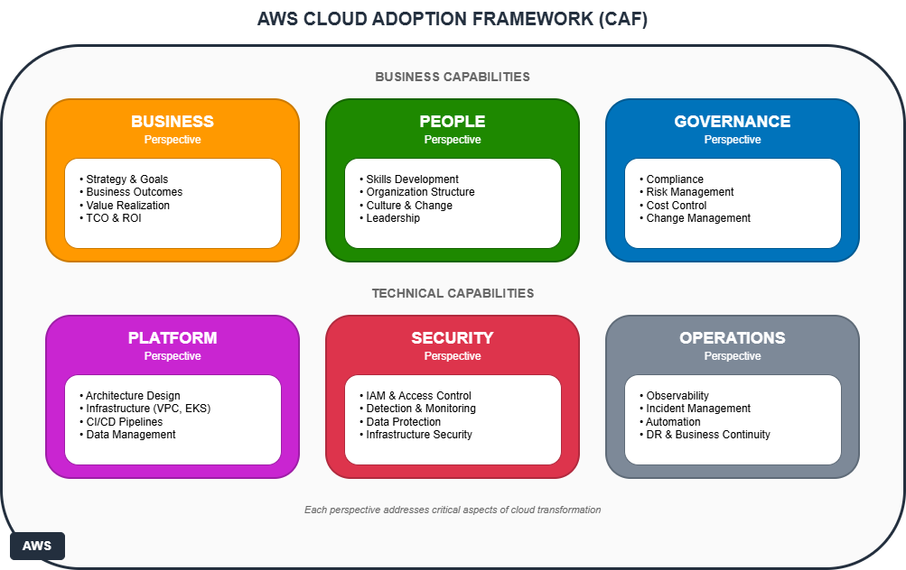

---

# 1. BUSINESS STUFF

## 1.1 Current situation

Startup constraints drive everything here:

| Problem | Now | Goal |
|---------|-----|------|
| Deploys | Manual, slow, painful | Multiple per day, no drama |
| Money | Tight | Under $700/mo initially |
| Scale | ¯\\\_(ツ)\_/¯ | 100x without rewriting |
| Security | User data we can't leak | Baked in from day 1 |
| Team | Small, not infra experts | Self-service, devs don't wait on ops |

## 1.2 Success metrics

| What | Measure | Target |
|------|---------|--------|
| Speed | Deploy frequency | Few times/day |
| Uptime | Availability | 99.9% |
| Cost efficiency | $/user at scale | < $0.01 |
| Dev speed | Commit → prod | < 1 hour |
| Security | Critical vulns | 0 |

### Timeline (roughly)

**Month 1-2** — Foundation. Accounts, VPC, EKS running, pipelines working.

**Month 3-4** — Hardening. Validate autoscaling actually works, tune alerts, cost optimization, DR test.

**Month 6+** — Growth mode. Handle whatever traffic comes, maybe multi-region.

## 1.3 Costs

### Early stage (<10K users)

| Item | $/mo | Notes |
|------|------|-------|
| EKS Control Plane | 73 | Fixed cost, annoying but unavoidable |
| EC2 (2-3 t3.medium) | 150-200 | Spot where possible |
| Aurora | 150-200 | db.t3.medium |
| NAT Gateway | 35 | Single NAT for now |
| VPC Endpoints | 25 | Essentials only |
| Data Transfer | 20 | Not much traffic yet |
| Secrets Manager | 5 | Few secrets |
| CloudWatch | 20 | Basic monitoring |
| **Total** | **~500-580** | |

### Growth stage (100K-1M users)

| Item | $/mo | Notes |
|------|------|-------|
| EKS Control Plane | 73 | Still fixed |
| EC2 (Spot/On-Demand mix) | 1,500-2,500 | 70% Spot |
| Aurora | 800-1,500 | r5.large + replicas |
| NAT Gateway | 100 | Multi-AZ |
| Data Transfer | 300-500 | CDN helps |
| Cloudflare Pro | 200 | CDN + security |
| Misc | 200 | |
| **Total** | **~3-5K** | |

### Cost savings levers

- **Spot** — 60-70% off for interruptible workloads
- **RIs** — 30-40% off once we know baseline
- **Infracost** — PR comments catch expensive changes
- **VPA** — Right-sizing recommendations
- **Cloudflare** — Offloads traffic, saves data transfer

---

# 2. PEOPLE

## 2.1 Team

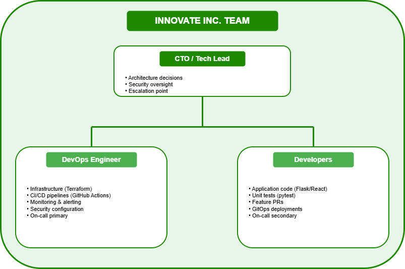

## 2.2 Skills

| Skill | Level | Notes |
|-------|-------|-------|
| AWS | Intermediate | CCP cert recommended |
| K8s | Basic-ish | EKS + managed add-ons makes this easier |
| Terraform | Intermediate | Modular code helps learning |
| ArgoCD | Basic | Learn by doing |
| Postgres | Basic | Aurora handles ops, just write queries |
| Security | Awareness | Guardrails are built-in |
| Monitoring | Basic | Dashboards are pre-made |

### Why managed services matter

| DIY approach | Our approach | Why |
|--------------|--------------|-----|
| Self-hosted K8s | EKS | No control plane expertise needed |
| Self-hosted Postgres | Aurora | No DBA |
| Manual deploys | GitOps | Devs push to Git, done |
| IAM from scratch | IRSA + templates | Security baked in |
| Custom observability | CloudWatch + EFK | Works out of the box |

## 2.3 RACI

| Task | CTO | DevOps | Dev |
|------|-----|--------|-----|
| Architecture | A/R | C | I |
| Infra (TF) | A | R | I |
| Deployments | I | C | R |
| Security | A | R | C |
| Incidents | A | R | C |
| Costs | A | R | I |
| Features | A | I | R |

## 2.4 Escalation

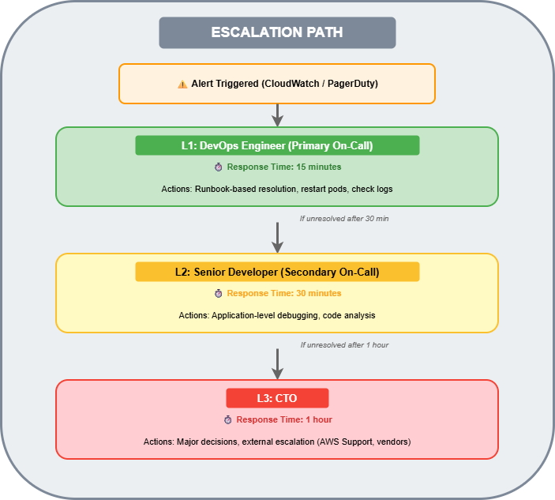

---

# 3. GOVERNANCE

## 3.1 Accounts

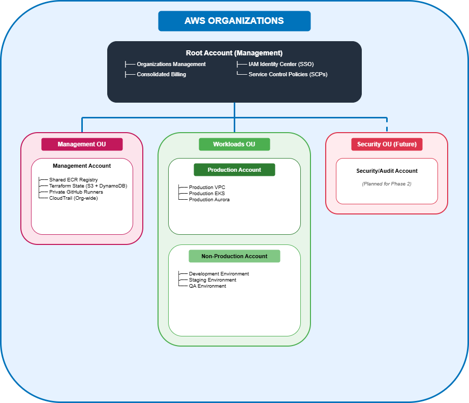

| Account | Purpose | Rationale |
|---------|---------|-----------|
| Management | Billing, identity, shared | Single source of truth |
| Production | Customer workloads | Isolation, blast radius |
| Non-Prod | Dev/staging/QA | Cost sharing, speed |

## 3.2 SCPs

Guardrails to prevent stupid mistakes (or malicious ones):

```json
{
  "Version": "2012-10-17",
  "Statement": [
    {
      "Sid": "DenyLeavingOrganization",
      "Effect": "Deny",
      "Action": "organizations:LeaveOrganization",
      "Resource": "*"
    },
    {
      "Sid": "DenyDisablingCloudTrail",
      "Effect": "Deny",
      "Action": [
        "cloudtrail:DeleteTrail",
        "cloudtrail:StopLogging"
      ],
      "Resource": "*"
    },
    {
      "Sid": "DenyRootUserActions",
      "Effect": "Deny",
      "Action": "*",
      "Resource": "*",
      "Condition": {
        "StringLike": {
          "aws:PrincipalArn": "arn:aws:iam::*:root"
        }
      }
    },
    {
      "Sid": "RequireIMDSv2",
      "Effect": "Deny",
      "Action": "ec2:RunInstances",
      "Resource": "arn:aws:ec2:*:*:instance/*",
      "Condition": {
        "StringNotEquals": {
          "ec2:MetadataHttpTokens": "required"
        }
      }
    }
  ]
}
```

## 3.3 Budgets

| Account | Budget | Alerts |
|---------|--------|--------|
| Management | $200 | 50/80/100/120% |
| Production | $3,000 | 50/80/100/110% |
| Non-Prod | $500 | 80/100% |

### Infracost

Every TF PR gets a cost estimate:

```
💰 Infracost Report

Monthly cost will increase by $45 (8.2%)

┌──────────────────────────────────────────────────────────────┐
│ Project              Previous   New        Diff              │
├──────────────────────────────────────────────────────────────┤
│ innovate-production  $547       $592       +$45 (+8.2%)      │
│                                                               │
│ + aws_instance.app   -          $45        +$45 (new)        │
│   └─ Instance (t3.large, on-demand)                          │
└──────────────────────────────────────────────────────────────┘

Review required for changes > $50.
```

## 3.4 Tags

Required on everything:

| Tag | Example |
|-----|---------|
| `Environment` | production, staging |
| `Owner` | platform-team |
| `Project` | innovate-app |
| `CostCenter` | engineering |
| `ManagedBy` | terraform |
| `DataClassification` | confidential |

Enforced via TF modules:

```hcl
locals {
  common_tags = {
    Environment        = var.environment
    Project           = "innovate-app"
    ManagedBy         = "terraform"
    Owner             = var.owner
    CostCenter        = var.cost_center
  }
}
```

## 3.5 Change management

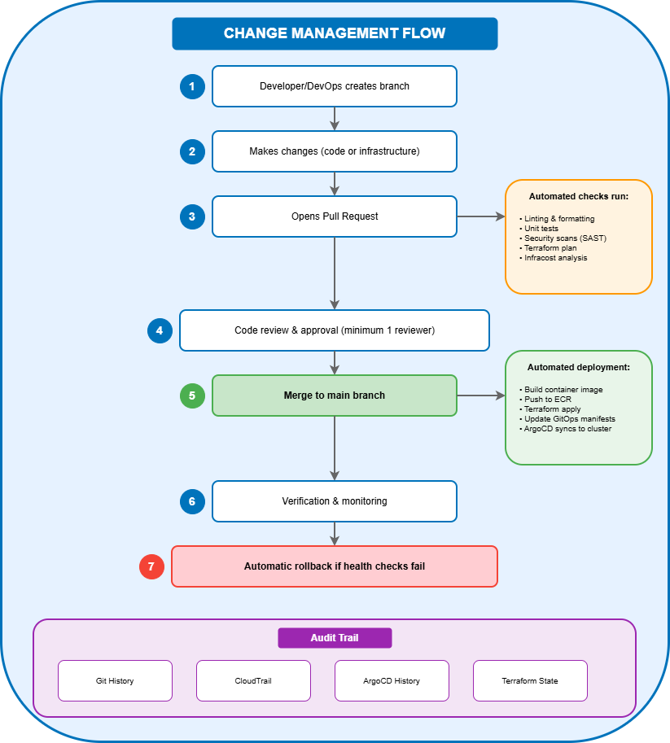

Audit trail: Git commits, CloudTrail, ArgoCD history, TF state versions.

---

# 4. PLATFORM

## 4.1 Architecture


## 4.2 Networking

### VPC (prod)

| Type | CIDRs | AZs | Contents |
|------|-------|-----|----------|
| Public | 10.1.0.0/20, .16.0/20, .32.0/20 | a,b,c | NAT, ALB |
| Private (App) | 10.1.48.0/20, .64.0/20, .80.0/20 | a,b,c | EKS nodes |
| Private (Data) | 10.1.96.0/20, .112.0/20, .128.0/20 | a,b,c | Aurora |

### Endpoints

| Endpoint | Type | Use |
|----------|------|-----|
| S3 | Gateway | Layers, TF state |
| ECR API/DKR | Interface | Images |
| Secrets Manager | Interface | Secrets |
| CloudWatch Logs | Interface | Logs |
| STS | Interface | IRSA |
| EC2 | Interface | Node mgmt |

### VPN

pfSense on-prem → Transit Gateway → all VPCs

## 4.3 EKS

| Setting | Value |
|---------|-------|
| Version | 1.31 |
| API | Private only |
| Secrets | KMS encrypted |
| Logging | All types |
| Add-ons | Managed (CoreDNS, kube-proxy, VPC CNI) |

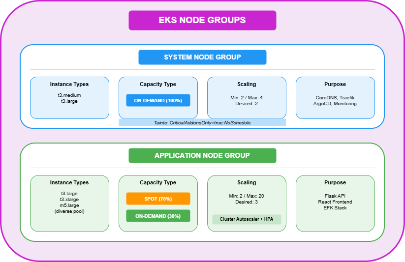

### Autoscaling

| What | Tool | Trigger |
|------|------|---------|
| Pods | HPA | CPU >70%, Mem >80% |
| Nodes | Cluster Autoscaler | Pending pods |
| Right-sizing | VPA | Recommendations |

## 4.4 Aurora

### Why Aurora?

| | Aurora | RDS |
|-|--------|-----|
| Failover | <30s | 60-120s |
| Storage | Auto to 128TB | Manual |
| Replicas | 15 | 5 |
| Backtrack | Yes | No |

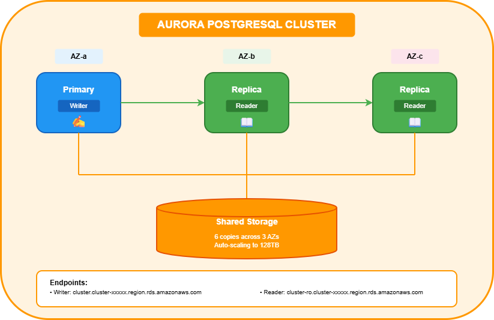

### Backups

| Type | Freq | Retention |
|------|------|-----------|
| Auto snapshots | Daily | 35d |
| Manual | Pre-release | 90d |
| PITR | Continuous | 35d |
| Backtrack | On-demand | 24h |
| Cross-region | Continuous | Realtime |

## 4.5 CI/CD

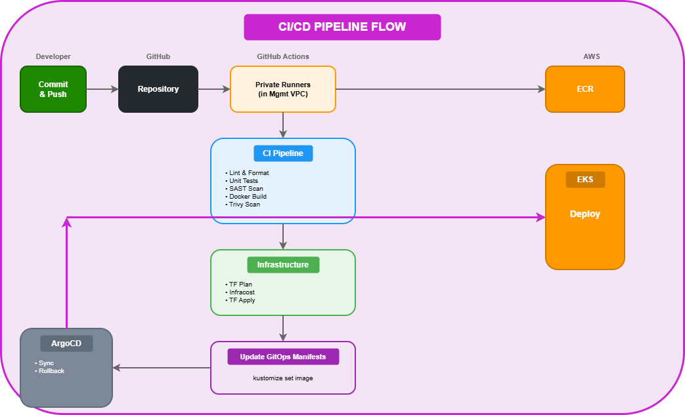

### ArgoCD app

```yaml
apiVersion: argoproj.io/v1alpha1
kind: Application
metadata:
  name: innovate-backend
  namespace: argocd
spec:
  project: default
  source:
    repoURL: https://github.com/innovate-inc/gitops-manifests.git
    targetRevision: HEAD
    path: overlays/production
  destination:
    server: https://kubernetes.default.svc
    namespace: production
  syncPolicy:
    automated:
      prune: true
      selfHeal: true
    retry:
      limit: 5
      backoff:
        duration: 5s
        factor: 2
        maxDuration: 3m
```

## 4.6 Terraform layout

```
terraform/
├── modules/
│   ├── vpc/
│   ├── eks/
│   ├── aurora/
│   ├── ecr/
│   └── github-runners/
├── environments/
│   ├── production/
│   └── staging/
└── global/
    ├── organizations/
    ├── iam/
    └── s3-backend/
```

---

# 5. SECURITY

## 5.1 Defense in depth

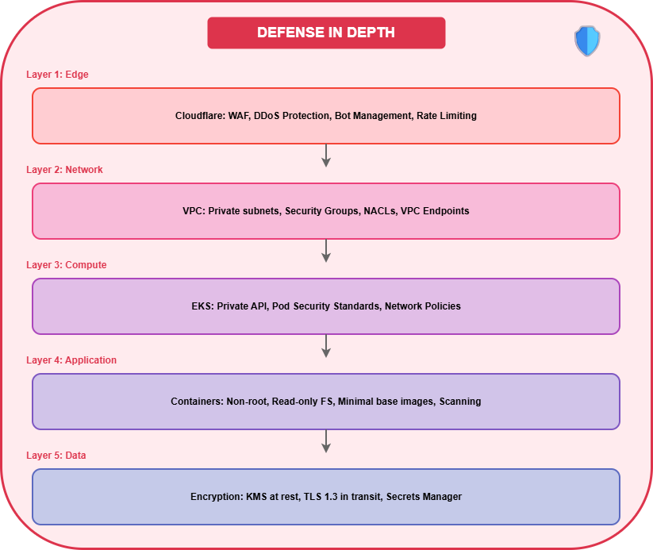

## 5.2 IAM

| What | How |
|------|-----|
| Humans | Identity Center + MFA |
| Services | IRSA |
| Cross-account | Trust policies |
| CI/CD | OIDC w/ GitHub |
| Break-glass | Alerts on CloudTrail |

### IRSA example

```yaml
apiVersion: v1
kind: ServiceAccount
metadata:
  name: backend-app
  namespace: production
  annotations:
    eks.amazonaws.com/role-arn: arn:aws:iam::123456789:role/innovate-backend-role
```

```hcl
resource "aws_iam_role" "backend" {
  name = "innovate-backend-role"

  assume_role_policy = jsonencode({
    Version = "2012-10-17"
    Statement = [{
      Effect = "Allow"
      Principal = {
        Federated = aws_iam_openid_connect_provider.eks.arn
      }
      Action = "sts:AssumeRoleWithWebIdentity"
      Condition = {
        StringEquals = {
          "${replace(aws_iam_openid_connect_provider.eks.url, "https://", "")}:sub" = "system:serviceaccount:production:backend-app"
        }
      }
    }]
  })
}
```

## 5.3 Network

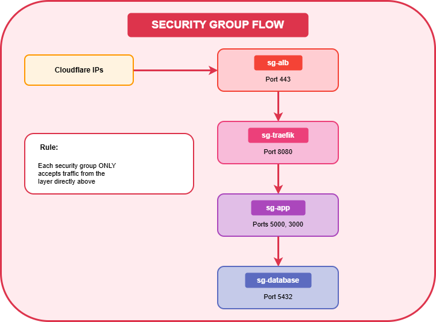

### NACLs

| Subnet | In | Out |
|--------|-----|-----|
| Public | 443 from CF | Private subnets |
| App | ALB only | Data + endpoints |
| Data | App only | Return traffic |

## 5.4 Encryption

**At rest**: Everything KMS CMK (EKS etcd, Aurora, S3, EBS)

**In transit**:
- Client → CF: TLS 1.3
- CF → ALB: TLS 1.2+ (strict)
- ALB → app: TLS 1.2+ (ACM)
- App → Aurora: TLS 1.2+ (RDS CA)

## 5.5 Secrets

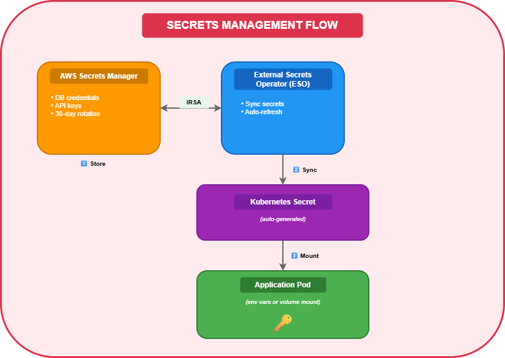

## 5.6 Container hardening

```dockerfile
FROM python:3.12-slim AS builder
WORKDIR /app
COPY requirements.txt .
RUN pip install --no-cache-dir --user -r requirements.txt

FROM python:3.12-slim
RUN useradd --create-home --shell /bin/bash appuser
WORKDIR /app
COPY --from=builder /root/.local /home/appuser/.local
COPY --chown=appuser:appuser . .
USER appuser
ENV PATH=/home/appuser/.local/bin:$PATH
EXPOSE 5000
CMD ["gunicorn", "--bind", "0.0.0.0:5000", "app:create_app()"]
```

```yaml
apiVersion: v1
kind: Pod
metadata:
  name: backend
spec:
  securityContext:
    runAsNonRoot: true
    runAsUser: 1000
    fsGroup: 1000
  containers:
    - name: app
      image: backend:latest
      securityContext:
        allowPrivilegeEscalation: false
        readOnlyRootFilesystem: true
        capabilities:
          drop: ["ALL"]
      resources:
        limits:
          cpu: "1"
          memory: "1Gi"
        requests:
          cpu: "250m"
          memory: "512Mi"
```

## 5.7 Scanning

| Where | Tool | What |
|-------|------|------|
| Pre-commit | Gitleaks | Secrets |
| CI | CodeQL | SAST |
| CI | Trivy | CVEs |
| CI | Checkov | TF misconfig |
| ECR | AWS | Vulns |
| Runtime | Falco | Anomalies (optional) |

---

# 6. OPERATIONS

## 6.1 Observability

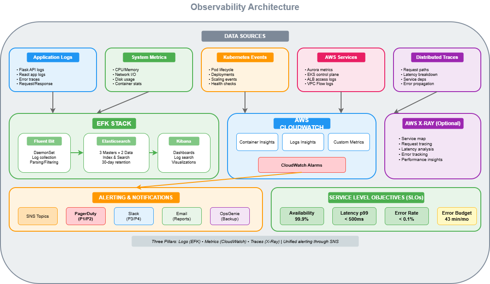

## 6.2 Alerts

### App

| Metric | Warn | Crit | Action |
|--------|------|------|--------|
| p99 latency | >300ms | >500ms | Scale, investigate |
| 5xx rate | >0.5% | >1% | Page, investigate |
| 4xx rate | >5% | >10% | Logs, abuse check |
| Request spike | +50% | +100% | Attack? Scale up |

### Infra

| Metric | Warn | Crit | Action |
|--------|------|------|--------|
| CPU | >70% | >85% | HPA, resize |
| Memory | >75% | >90% | HPA, leak check |
| Pod restarts | >3/hr | >10/hr | CrashLoop |
| Node count | Near max | At max | Raise limit |

### DB

| Metric | Warn | Crit | Action |
|--------|------|------|--------|
| Connections | >70% | >85% | Pooling, replicas |
| CPU | >70% | >85% | Scale, replicas |
| Free mem | <30% | <15% | Scale |
| Replica lag | >100ms | >1s | Network? |

## 6.3 Incidents

| Sev | Meaning | Response | Example |
|-----|---------|----------|---------|
| P1 | Down | 15min | API dead |
| P2 | Major | 30min | Login broken |
| P3 | Degraded | 4hr | Slow endpoint |
| P4 | Minor | Next day | UI bug |


## 6.4 Runbooks

### CrashLoopBackOff

1. `kubectl get pods -n <ns>`
2. `kubectl logs <pod> -n <ns> --previous`
3. `kubectl describe pod <pod> -n <ns>`
4. `kubectl top pod <pod> -n <ns>`

| Cause | Fix |
|-------|-----|
| OOM | Raise memory |
| Bad config | Check secrets/configmaps |
| Dep down | Check upstream |
| Bad image | Check ECR |

Escalate to L2 after 30min.

### DB connection issues

1. RDS console status
2. `aws ec2 describe-security-groups --group-ids <sg>`
3. CloudWatch → connections
4. `kubectl exec -it <pod> -- nc -zv <endpoint> 5432`

| Cause | Fix |
|-------|-----|
| Max conn | Scale, replicas |
| SG | Fix rules |
| Rotated creds | Sync External Secrets |
| Failover | Wait |

DB down = P1.

## 6.5 Backups & recovery

| What | How | Freq | Retention |
|------|-----|------|-----------|
| Aurora | Snapshots | Daily | 35d |
| Aurora | Manual | Pre-release | 90d |
| TF state | S3 versioning | Per apply | 90d |
| K8s manifests | Git | Per commit | Forever |

### RTO/RPO

| Scenario | RTO | RPO |
|----------|-----|-----|
| Pod dies | <1min | 0 |
| Node dies | <5min | 0 |
| AZ down | <15min | 0 |
| DB corrupt | <1hr | <5min |
| Region down | <30min | <1min |
| Accidental delete | <15min | <24hr |

## 6.6 SLOs

| Service | Target | Budget |
|---------|--------|--------|
| Availability | 99.9% | ~44min/mo |
| Latency (p99) | <500ms | 1% can exceed |
| Deploy success | 99% | 1 fail per 100 |
| Data durability | 11 nines | Aurora standard |

---

# 7. DR

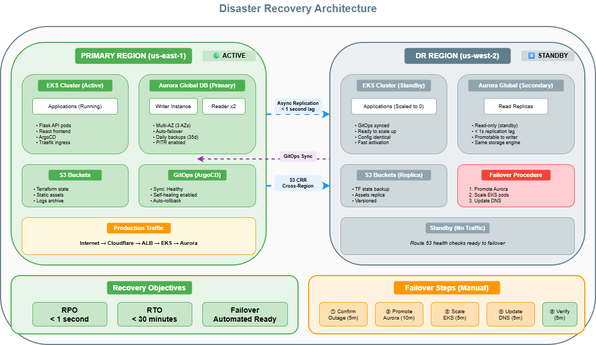

## 7.1 Automated

Route 53 health checks: 3 consecutive failures (90s) → auto-failover

## 7.2 Manual failover

| Step | Time | Do |
|------|------|----|
| 1. Confirm | 5min | Actually down? Check AWS status, try VPN |
| 2. Failover | 10min | CF DNS → DR ALB, promote Aurora, scale EKS |
| 3. Verify | 10min | Test app, check DB, dashboards, logs |
| 4. Comms | 5min | Status page, stakeholders, doc timeline |

### Commands

```bash
# Aurora failover
aws rds failover-global-cluster \
  --global-cluster-identifier innovate-global \
  --target-db-cluster-identifier innovate-dr

# Scale DR
kubectl scale deployment --all --replicas=3 -n production
```

---

# 8. WRAP UP

## What we covered

| Area | Summary |
|------|---------|
| Business | Costs, metrics |
| People | Team, RACI, skills |
| Governance | Accounts, SCPs, tags |
| Platform | VPC, EKS, Aurora, CI/CD |
| Security | IAM, encryption, scanning |
| Operations | Monitoring, incidents, DR |

## Implementation

| Phase | Weeks | What |
|-------|-------|------|
| 1 | 1-2 | Accounts, Orgs, Identity Center |
| 2 | 2-3 | VPC, networking |
| 3 | 3-5 | EKS, Aurora, ECR |
| 4 | 5-6 | GitHub Actions, ArgoCD |
| 5 | 6-7 | Secrets, scanning |
| 6 | 7-8 | Monitoring, alerting |
| 7 | 8-9 | DR, failover test |
| 8 | Ongoing | Optimization |

## Done when

- [ ] All envs accessible
- [ ] CI/CD < 15min
- [ ] Monitoring works
- [ ] DR tested
- [ ] Security scans pass
- [ ] Costs on track
- [ ] Team comfortable

---

*Last updated Dec 2024 • v2.0 • Review quarterly*
